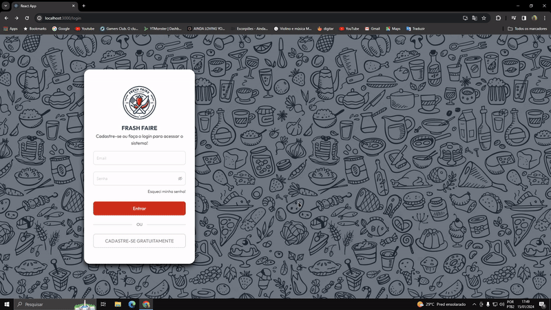
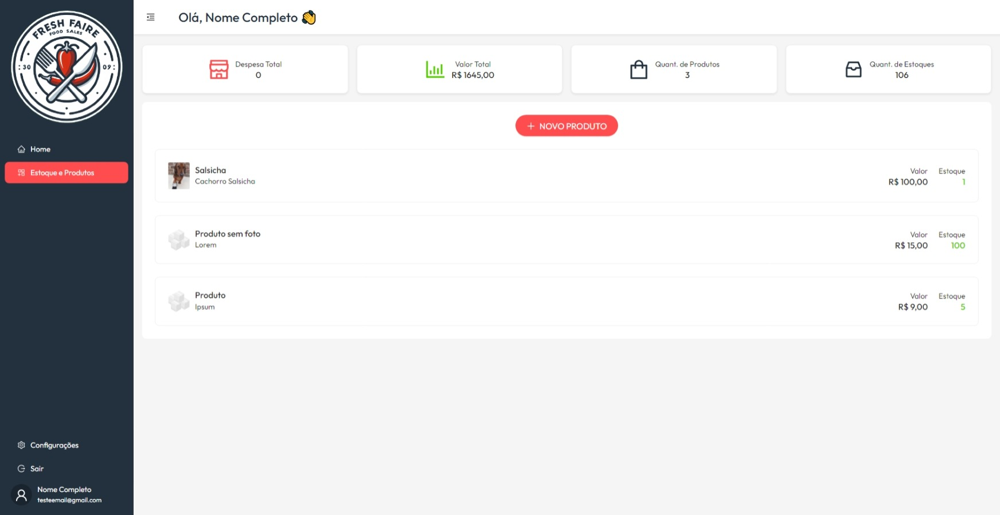
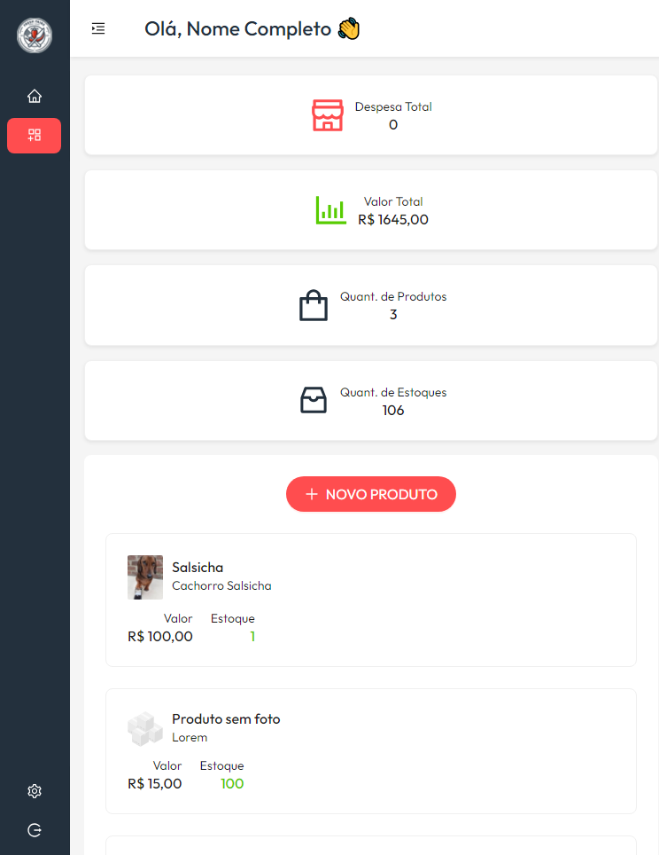
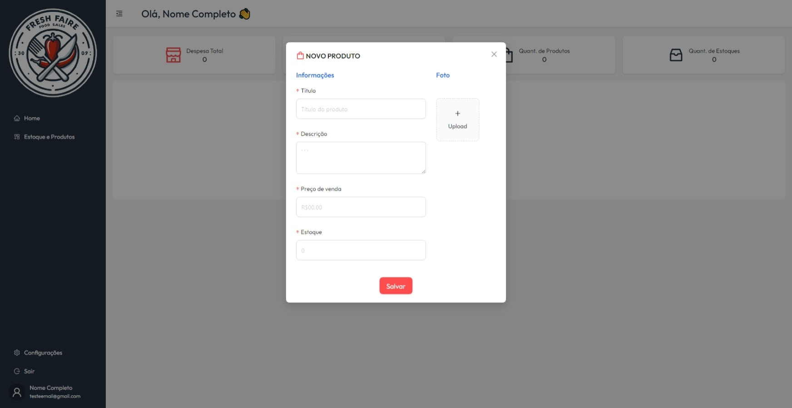
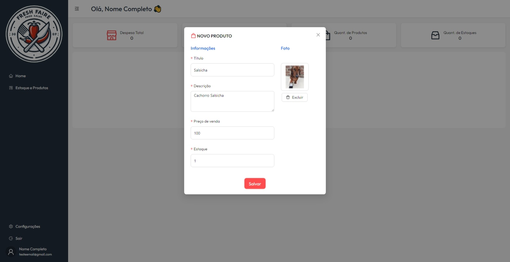
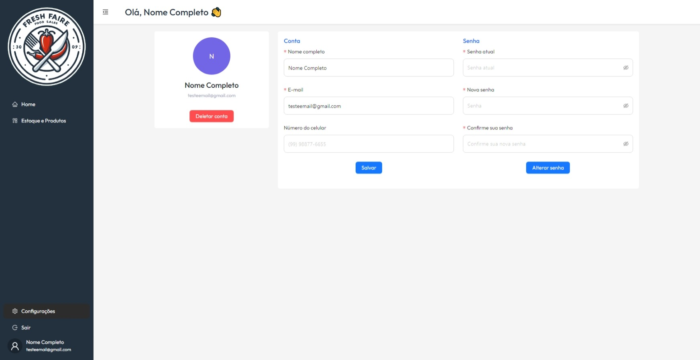

# SOBRE O PROJETO
Escrever algo ainda

# Acesso ao Login & Cadastro
Escrever algo ainda

# Admin dos Produtos
Escrever algo ainda

# 🖥️ INTERFACES
### Tela de cadastro e login
<p align-items="center">
    
</p>

### Tela de principal
- Estoque
<p align-items="center">
    
</p>

<p align-items="center">
    
</p>


- Novo Produto
<p align-items="center">
    
</p>
<p align-items="center">
    
</p>

### Tela de configurações
<p align-items="center">
    
</p>
 
# 🎲 Rodando o código

### FrontEnd
```bash
# Clone este repositório
$ git clone <https://github.com/maycon-mdrs/login-react>

# Acesse a pasta do projeto
$ cd login-react

# Instale as dependências
$ npm install

# Execute a aplicação em modo de desenvolvimento
$ npm start

# Acesse <http://localhost:3000>
```

### BackEnd
Necessário rodar o backend para testar o front!

`Repositório:` https://github.com/maycon-mdrs/e-commerce-admin 

# 🛠 Tecnologias

As seguintes ferramentas foram usadas na construção do projeto:

- [React](https://pt-br.reactjs.org/)
- [TypeScript](https://www.typescriptlang.org/)
- [Node.js](https://nodejs.org/en/)
- [AntDesign](https://ant.design/)
- [BootStrap](https://getbootstrap.com/)

# Autor

<a href="https://github.com/maycon-mdrs" style= "float: left">
    <div style="display: flex; flex-direction: column; align-items: center">
        
        <br />
        <strong>Maycon Douglas Rêgo Santos 🚀</strong>
    </div>
</a>
